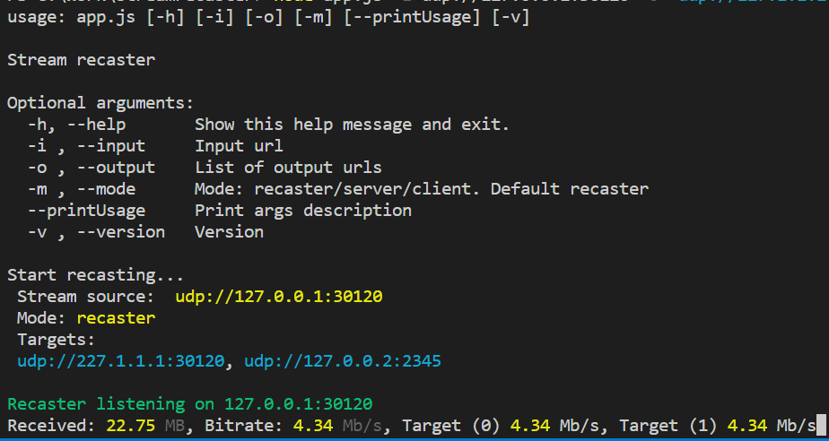

# Stream Recaster

**Stream Recaster** is an application that provides recasting and stream tunneling services. 
You can recast udp unicast / multicast streams to multiple udp (unicast / multicast ) or tcp targets.



## Usage

```
streamRecaster -i udp://127.0.0.1:30120 -o udp://227.1.1.1:30122
```

### Options

| Flag     |      Name     | Description |
|----------|:-------------:|:--------------------------------------------|
| -i       | --input       | Input url |
| -o       | --output      | List of output urls (should be passed as a string, for example -o 'udp://227.1.1.1:30122 tcp://127.0.0.1:1234') |
| -t       | --timeout     | Stream timeout detection in ms |
|          | --printUsage  | Print args description (true/false) |
| -v       | --version     | Version |

> To specify the network interface, andd "/nic=X.X.X.X", for example udp://227.1.1.1:30120/nic=172.16.106.10

### Usage

> Note. For compiled version, use **streamRecaster.exe** instead of  **node app.js**


#### Docker

```
docker run -it --rm --network host impleo/stream-recaster:1.0.7 -i udp://0.0.0.0:30120 -o udp://227.1.1.1:30122
```


#### UDP / TCP recasting

1. Recasting UDP unicast to multicast or vice versa:

```
node app.js -i udp://127.0.0.1:30120 -o udp://227.1.1.1:30122
``` 
> Note, if you need to select specific network interface, add  **/nic=X.X.X.X** (for example **/nic=192.168.99.1**) to the **url**

2. Recasting UDP unicast/multicast to tcp:

```
node app.js -i udp://127.0.0.1:30120 -o tcp://127.0.0.1:1234
```

3. Recasting to multiple targets:
It is possilbe to combine different output stream protocols. For example, as shown below, you can simultaneousy recast to **udp** and **tcp** targets.
```
node app.js -i udp://127.0.0.1:30120 -o 'udp://227.1.1.1:30122 tcp://127.0.0.1:1234'
```

